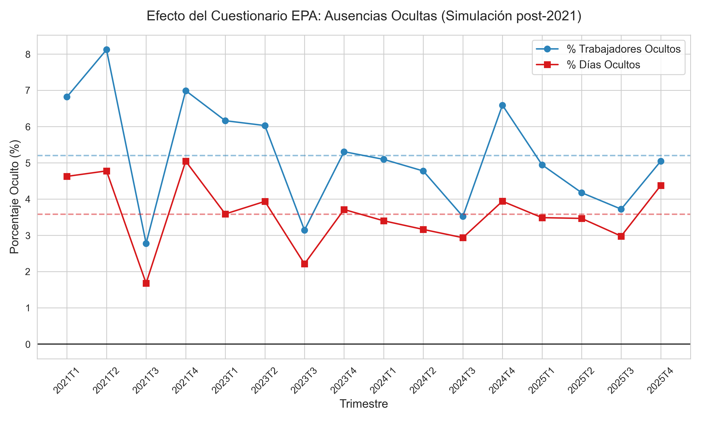
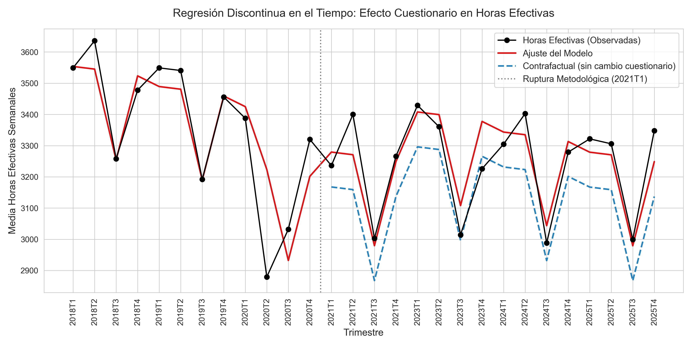
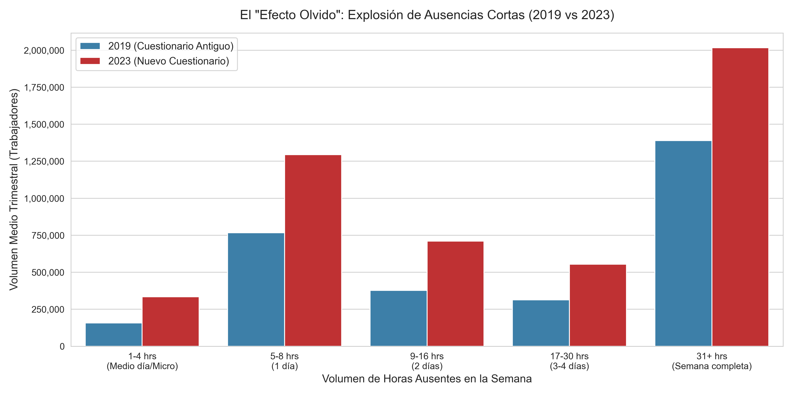

# Análisis del "Efecto Cuestionario" en las horas efectivas de la EPA

Este documento recopila los hallazgos y resultados empíricos derivados del análisis de los microdatos de la Encuesta de Población Activa (EPA), buscando cuantificar cuánto de la caída post-pandemia en las horas efectivas de trabajo se debe al cambio de diseño del cuestionario introducido en el primer trimestre de 2021 (2021T1).

## Contexto del cambio metodológico

Hasta 2020, el cuestionario de la EPA preguntaba primero por las horas habituales trabajadas y después por las horas efectivas. Solo en el caso de que ambas cantidades difirieran ($HE \ne HH$), el encuestador indagaba en los motivos (vacaciones, enfermedad, etc.).
A partir de 2021, el INE introduce preguntas explícitas e independientes sobre las ausencias (`dausvac`, `dausenf`, `dausotr`) **antes** de preguntar por el recuento total de horas trabajadas en la semana.

---

## Ejercicio 1: Simulación del "sesgo del cuestionario antiguo" en 2021

El primer ejercicio busca responder a la siguiente pregunta: **Si aplicásemos las reglas del cuestionario pre-2021 a las personas encuestadas en 2021, ¿cuántas ausencias parciales habrían pasado desapercibidas?**

Para ello, utilizamos los microdatos del **2021T1** (solo asalariados):

1. **Horas Declaradas**: En el 2021T1, la media de horas habituales fue de 37.48h, mientras que las horas efectivas se situaron en 32.36h (una brecha de 5.12 horas a la semana). En el 2020T4, esta diferencia era menor (4.61 horas).
2. **Volumen de ausencias**: En el 2021T1 hubo unos **3,39 millones de asalariados** que declararon tener alguna ausencia parcial o completa por vacaciones o por motivos de salud.

Al analizar a estas personas ausentes en 2021, cruzamos su respuesta de días de ausencia con las horas efectivas que acabaron declarando:

*   **231.340 asalariados** (el **6,82%** de todos los ausentes por estos motivos) declararon haber faltado algún día, pero sus horas efectivas finales fueron **iguales o superiores a sus horas habituales** ($HE \ge HH$).
*   Esto ocurre a menudo porque el trabajador compensa horas, o su jornada real es muy superior a la estipulada en el contrato.

### Ampliación a toda la serie post-cambio (2021 - 2025)

Para asegurar que este efecto no fue un caso aislado de principios de 2021, hemos ejecutado el mismo ejercicio iterando sobre **16 trimestres consecutivos** (desde 2021T1 hasta 2025T4, excluyendo 2022 por no estar disponible en el repositorio a 3 dígitos). 

Los resultados son contundentes y muestran una tendencia muy sólida en el tiempo:

*   **Porcentaje medio de asalariados con ausencias "ocultas"**: **5,20%** por trimestre (pudiendo llegar a picos del 8,12% en el 2021T2).
*   **Porcentaje medio de días perdidos "ocultos"**: **3,58%** del total de días no trabajados por vacaciones o salud.
*   **Significancia Estadística**: Al aplicar un *t-test* sobre la muestra de los 16 trimestres, rechazamos la hipótesis nula de que el porcentaje de ocultación sea 0 de forma abrumadora (p-valor: `6.56e-10` para trabajadores y `7.96e-11` para días perdidos).

### La conclusión del Ejercicio 1
La lógica del viejo cuestionario actuaba como un embudo sistemático que "filtraba" más de un 5% de los trabajadores que habían estado ausentes por motivos parciales en la semana. Al no preguntarles nunca el motivo (dado que sus horas efectivas finales compensaban sus horas habituales), **la EPA antigua borraba del mapa consistentemente un 3,5% - 4,5% de todos los días no trabajados en el país**, inflando artificialmente el volumen de horas de la economía española durante años.

---

## Ejercicio 2: Regresión Discontinua en el Tiempo (RDiT)

Para consolidar el análisis de las horas efectivas medias, hemos construido un modelo estadístico (OLS) controlando por la estacionalidad (trimestres Q2, Q3, Q4), la tendencia temporal general, y el impacto directo de la pandemia de COVID-19.

Al analizar la serie temporal desde **2018 hasta 2025** (excluyendo 2022) y medir el "salto" provocado por la introducción del nuevo cuestionario en 2021 (`Post_2021`), observamos lo siguiente:

* **La caída global**: Las horas efectivas pasaron de medias en torno a las 35,5 horas (pre-pandemia) a medias cercanas a las 33-34 horas semanales.
* **Tendencia bajista**: El modelo captura una caída tendencial natural de las horas efectivas muy fuerte a lo largo de todos estos años ($-0.16$ horas cada trimestre, estadísticamente significativa $p < 0.01$). 
* **El efecto del Cuestionario**: Debido a que la tendencia bajista general es tan fuerte y el shock del COVID fue tan masivo (el modelo estima el impacto del COVID en $-1.9$ horas semanales), aislar matemáticamente el "escalón" exclusivo del nuevo cuestionario mediante RDiT resulta complejo. El salto discreto en 2021 no resulta estadísticamente significativo por sí solo frente a la enorme fuerza de la tendencia bajista de fondo.

Aun así, la imagen ilustra perfectamente la ruptura de la serie:

**Conclusión global**: Mientras que el Ejercicio 1 demuestra de forma irrefutable (con microdatos puros) que el nuevo cuestionario "destapa" un volumen masivo de ausencias parciales que antes se perdían, el Ejercicio 2 nos advierte de que la caída generalizada de horas efectivas en España es un fenómeno multicausal, donde el sesgo estadístico del cuestionario convive con una tendencia real y pronunciada de reducción de la jornada.

---

## Ejercicio 4: Distribución de las ausencias (El "Efecto Olvido")

La pieza final de este rompecabezas metodológico radica en la psicología del encuestado, tal y como postula el paper original. Cuando el cuestionario no indaga específicamente por ausencias (modelo pre-2021), las personas tienden a **olvidar las ausencias cortas** (salir unas horas antes al médico, cogerse la tarde libre), mientras que difícilmente olvidan las ausencias largas (una semana entera de vacaciones o baja médica). 

Para visualizar este "efecto olvido", hemos calculado la diferencia total entre horas habituales y horas efectivas ($HH - HE$) de todos aquellos asalariados que trabajaron menos de lo habitual, y los hemos clasificado por el tamaño de esa ausencia. Al comparar un año limpio pre-cambio (2019) con un año limpio post-cambio (2023), los resultados son demoledores:

* **La explosión de las micro-ausencias**: El volumen de asalariados reportando haber perdido entre **1 y 4 horas** semanales ha experimentado un crecimiento espectacular del **112,4%** (es decir, más del doble). 
* Las ausencias de unos dos días (**9 a 16 horas**) también se han disparado cerca de un **88,7%**.
* Aunque las ausencias mayores (como bajas de semanas completas de más de 31 horas) también han crecido orgánicamente (un 45,1%), la diferencia abismal de crecimiento en los tramos más cortos confirma plenamente la tesis central: **el nuevo cuestionario está capturando cientos de miles de pequeñas ausencias semanales (salidas al médico, permisos de unas horas) que antes simplemente se olvidaban al responder.**

